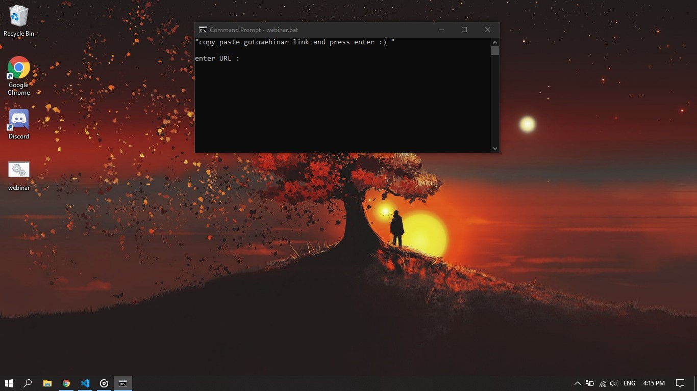

reason behind this file is that i dont wanted to install the webinar app as i am running low on space and RAM  

so this is a small bat file which just edits the address and make possible to open in your default browser 

any pull requests are welcomed and i am not a pro just a lazy user so dont hate me :) 

  

this is a winows batch file and won't work with other OS   

concept :  
whenever a link of goto webinar is opened windows users are forced to download the webinar app . some user like me faces isues like low space and don't want to install such application 
i was using linux and found out that to gotowebinar also works with browsers  
this is example of normal url : https://global.gotowebinar.com/join/67........81/766567758  
 
to open this link in browser " ?clientType=html5 " is added which forces gotowebinar to open in browser 

URL when entered in bat file : https://global.gotowebinar.com/join/67........81/766567758?clientType=html5

